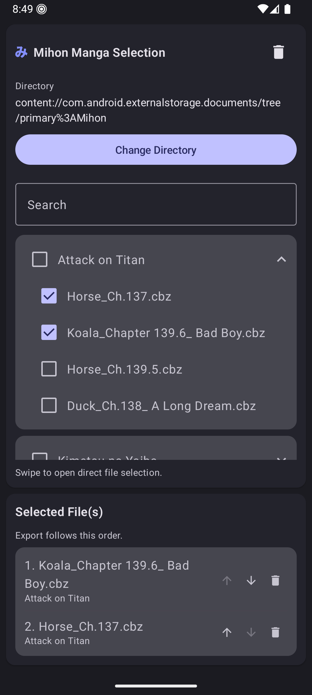
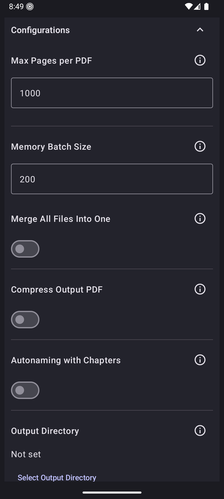
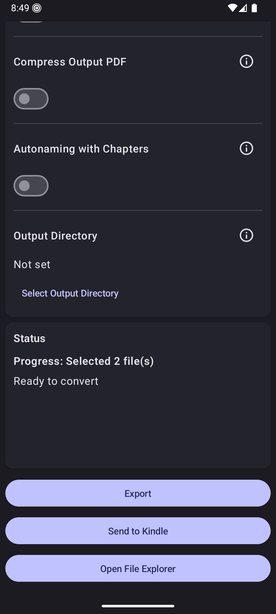

  

  <h1>CBZConverter</h1>
  
  A powerful and efficient Android app to convert your <code>.cbz</code> manga archives into <code>.pdf</code> files directly on your device.

## ✨ Features

- **Batch Conversion:** Convert one or many CBZ files in a single run.
- **Smart Merging:** Merge multiple archives into a single PDF—even across different series, with clear warnings when mixing sources.
- **Organization & Sorting:** Keep large series organized with sorting, custom output names, and optional chapter-aware auto-naming.
- **Memory Optimized:** Control memory usage with configurable batch sizes and page limits. Huge books automatically split into parts to prevent crashes.
- **Mihon Integration:** Browse files manually or directly load your Mihon downloads for quick checkbox selection.
- **Customizable Output:** Optional PDF compression and the ability to pick a custom output directory.

## 📱 Previews

  
  
  

---
